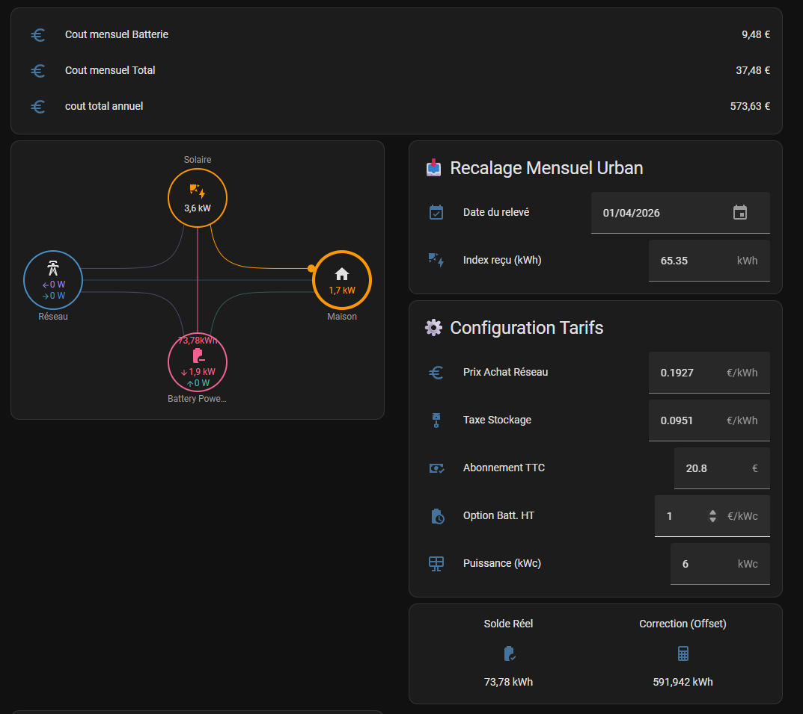

# My_Virtual_Battery


## 📊 Visualisation recommandée
Pour un rendu optimal comme sur la capture d'écran, il est recommandé d'utiliser la carte Lovelace [power-flow-card-plus](https://github.com/flixlix/power-flow-card-plus) disponible sur HACS. 

L'intégration `MyVirtualBattery` fournit les entités nécessaires pour alimenter les champs "Individual" ou "Battery" de cette carte.

# 🔋 Batterie Virtuelle Home Assistant

Système de **batterie virtuelle** basé sur les données **Enphase** et **Enedis/Linky**,
avec correction automatique de dérive quotidienne via les index officiels Enedis.

---

## Architecture

```
Enphase (temps réel)
  sensor.battery_power_in/out
       ↓ intégrale (platform: integration)
  energy_battery_power_in/out
       ↓
       +  offset_batterie_virtuelle  ←──────────────────────────┐
       ↓                                                         │
  batterie_virtuelle_solde                            ┌──────────┴──────────┐
  (vérité terrain temps réel)              Synchro Enedis       Recalage Urban Solar
                                           (automatique J-1)    (manuel, relevé fournisseur)
```

---

## Fonctionnement

### Deux mécanismes de correction coexistent

**⚡ Synchro Enedis automatique** — `sync_batterie_enedis_quotidien`
- Déclenché chaque jour à **10h30** (après mise à jour HA Linky entre 6h et 10h)
- Compare la production Enphase de la veille avec l'index officiel Enedis
- Cumule l'écart dans `input_number.offset_batterie_virtuelle`
- Limite de sécurité : **5 kWh max** par correction (protection données aberrantes)
- Non déclenchée au redémarrage de HA

**☀️ Recalage Urban Solar manuel** — `recalage_batterie_virtuelle`
- Déclenché par la mise à jour de `input_number.releve_urban_solar`
- Repart du relevé officiel fournisseur comme vérité absolue
- Recalcule l'offset depuis zéro (correction absolue, pas cumulative)

### Hiérarchie des corrections

```
Recalage Urban Solar  →  correction absolue (vérité contractuelle)
       ↓
Synchro Enedis        →  corrections quotidiennes fines (dérive Enphase vs Enedis)
       ↓
Batterie Virtuelle    →  solde temps réel corrigé
```

### Notification Telegram

Tout changement de l'offset déclenche automatiquement une notification Telegram
(`notify_batterie_offset_change`) avec le contexte de la correction (source, delta,
détail production si synchro Enedis, solde batterie).

---

## Fichiers

| Fichier | Rôle |
|---|---|
| `automations.yaml` | Synchro Enedis, recalage Urban Solar, notification Telegram |
| `sql.yaml` | Sensors SQL : index Linky (conso/prod), historique batterie |
| `template.yaml` | Calculs temps réel : solde, puissances, coûts |
| `sensors.yaml` | Intégrales énergie batterie (`platform: integration`) |
| `utility_meter.yaml` | Compteurs cycliques (mensuel, annuel) |
| `inputs.yaml` | Paramètres : offset, tarifs, relevés, installation |
| `input_datetime.yaml` | Date de référence relevé Urban Solar |

---

## Prérequis

- **Home Assistant** avec add-on **[HA Linky](https://github.com/bokub/ha-linky)**
- Compte Enedis avec token **[Conso API](https://conso.boris.sh/)**
- Onduleur **Enphase** avec intégration Home Assistant
- Bot **Telegram** configuré dans Home Assistant

---

## Points d'attention

> ⚠️ Les `metadata_id` dans `sql.yaml` (ex: `178`, `179`) sont **propres à cette installation**.
> Les vôtres seront différents — voir [ENEDIS_SETUP.md](ENEDIS_SETUP.md) pour les retrouver.

> ⚠️ La synchro Enedis compare production injectée (Enedis) et énergie entrée en batterie
> virtuelle (Enphase). Vérifiez la cohérence des deux sources avant activation —
> voir [ENEDIS_SETUP.md](ENEDIS_SETUP.md) §5.

---

## Installation complète Enedis

👉 Voir **[ENEDIS_SETUP.md](ENEDIS_SETUP.md)**

---

## Corrections à apporter après clonage

1. Adapter les `metadata_id` dans `sql.yaml` (voir ENEDIS_SETUP.md §4)
2. Renseigner votre `chat_id` Telegram dans `automations.yaml`
3. Mettre à jour le PRM et le token dans la config HA Linky
4. Ajuster `input_number.offset_batterie_virtuelle` avec votre valeur initiale


## 📂 Ressources Techniques 

Vous trouverez dans le [dossier](https://github.com/kaceby/My_Virtual_Battery/tree/main/logic_reference/legacy_YAML)


